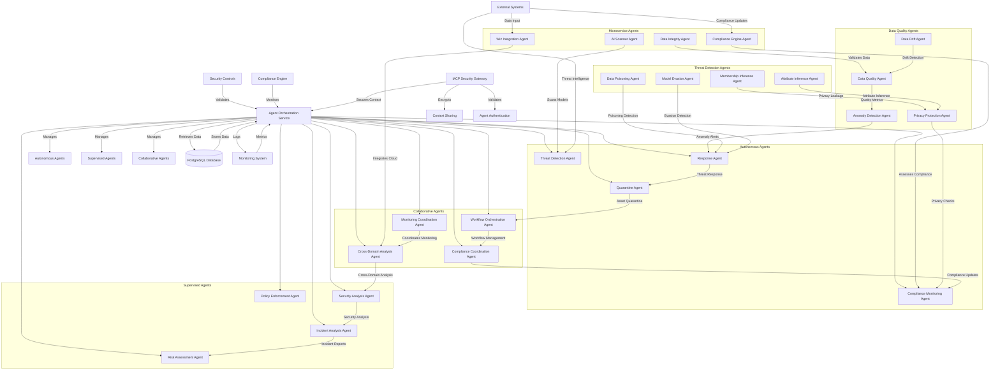
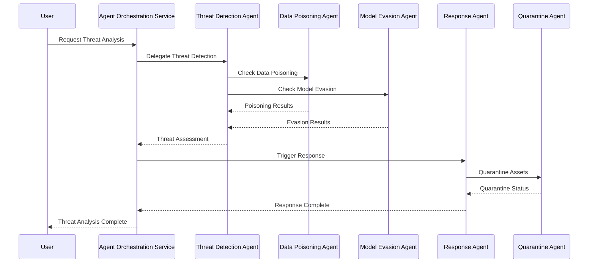
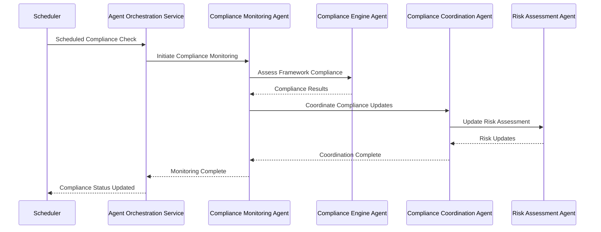
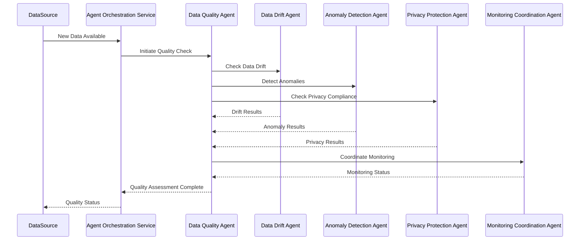
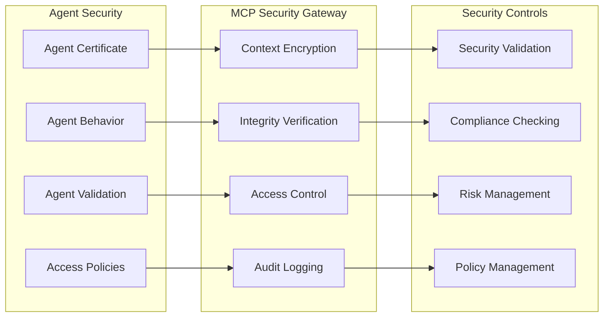
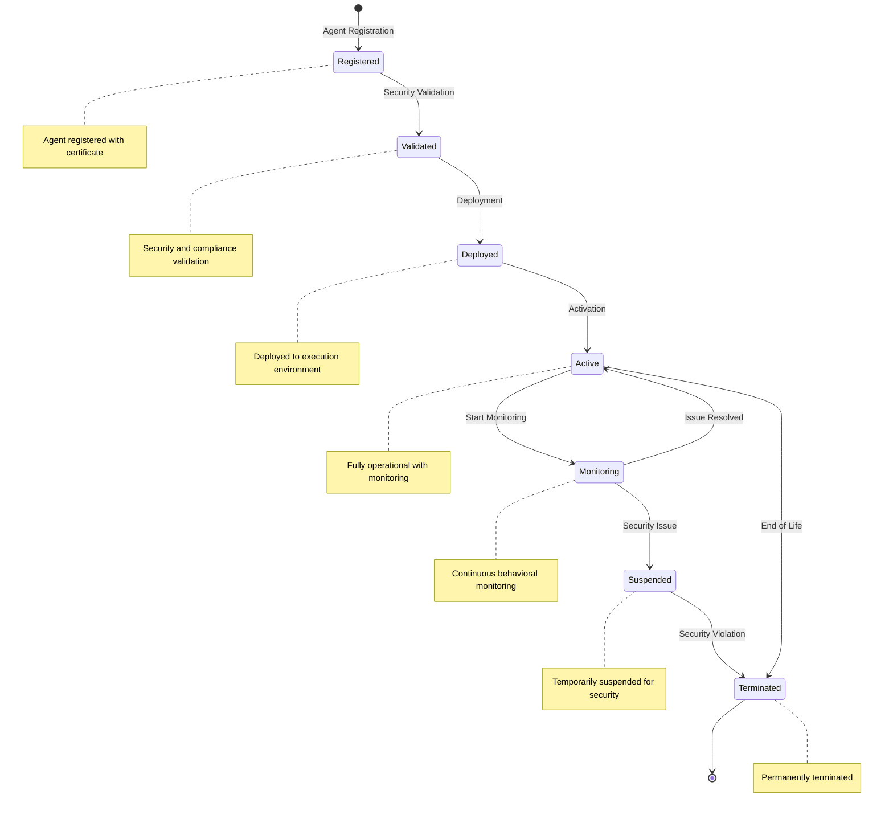
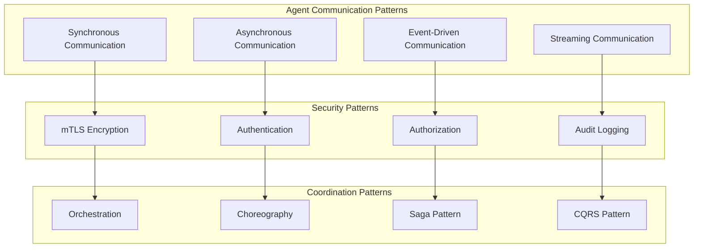

# Agentic Workflow Diagram - AI Security Posture Management Platform

## Overview

This document provides a comprehensive visual representation of the agentic workflows in the AI-SPM platform, showing the different types of agents, their purposes, and how they interact with each other to ensure comprehensive AI security posture management.

## Agent Architecture Overview

The AI-SPM platform implements a multi-layered agentic architecture with specialized agents for different security domains, orchestrated through a central Agent Orchestration Service with comprehensive security controls and compliance monitoring.

## 🎯 Agent Types and Classifications

### 1. Core Agent Types

#### **Autonomous Agents**
- **Purpose**: Independent decision-making and execution
- **Security Level**: High to Critical
- **Use Cases**: Real-time threat response, automated compliance assessment
- **Examples**: Threat Detection Agents, Compliance Monitoring Agents

#### **Supervised Agents**
- **Purpose**: Human-guided execution with oversight
- **Security Level**: Medium to High
- **Use Cases**: Complex security analysis, policy enforcement
- **Examples**: Security Analysis Agents, Policy Enforcement Agents

#### **Collaborative Agents**
- **Purpose**: Multi-agent coordination and cooperation
- **Security Level**: Medium to High
- **Use Cases**: Cross-domain security analysis, workflow orchestration
- **Examples**: Workflow Orchestration Agents, Cross-Domain Analysis Agents

### 2. Security Domain Agents

#### **Threat Detection Agents**
- **Data Poisoning Detection Agent**: Detects malicious training data
- **Model Evasion Detection Agent**: Identifies adversarial attacks
- **Membership Inference Detection Agent**: Prevents privacy leakage
- **Attribute Inference Detection Agent**: Protects sensitive attributes

#### **Compliance Agents**
- **GDPR Compliance Agent**: Monitors data protection compliance
- **AI Act Compliance Agent**: Ensures EU AI Act adherence
- **NIST RMF Agent**: Implements NIST AI Risk Management Framework
- **SOC 2 Agent**: Maintains SOC 2 controls

#### **Data Quality Agents**
- **Data Integrity Agent**: Monitors data quality and consistency
- **Data Drift Agent**: Detects distribution shifts
- **Anomaly Detection Agent**: Identifies unusual patterns
- **Privacy Protection Agent**: Ensures PII compliance

## 🔄 Agentic Workflow Diagram



## 🔧 Detailed Agent Interactions

### 1. Threat Detection Workflow



### 2. Compliance Monitoring Workflow



### 3. Data Quality Monitoring Workflow



## 🛡️ Security Controls and Agent Management

### Agent Authentication and Authorization



### Agent Lifecycle Management



## 📊 Agent Metrics and Monitoring

### Agent Performance Metrics

| Metric Type | Description | Measurement |
|-------------|-------------|-------------|
| **Authentication Success Rate** | Percentage of successful agent authentications | 99.9% target |
| **Task Completion Rate** | Percentage of successfully completed tasks | 95% target |
| **Response Time** | Average time to complete agent tasks | <1 second |
| **Security Score** | Overall security posture score | 0-100 scale |
| **Compliance Score** | Compliance adherence score | 0-100 scale |
| **Resource Utilization** | CPU, memory, network usage | Real-time monitoring |
| **Error Rate** | Percentage of failed operations | <1% target |

### Agent Interaction Patterns



## 🔄 Workflow Execution Patterns

### 1. Sequential Workflow
- **Pattern**: Linear execution of agent tasks
- **Use Case**: Simple security checks, compliance assessments
- **Example**: Data validation → Quality check → Privacy scan → Compliance check

### 2. Parallel Workflow
- **Pattern**: Concurrent execution of independent agent tasks
- **Use Case**: Multi-domain security analysis, comprehensive threat detection
- **Example**: Simultaneous threat detection across multiple vectors

### 3. Conditional Workflow
- **Pattern**: Branching execution based on conditions
- **Use Case**: Risk-based security responses, compliance decision trees
- **Example**: If high risk → escalate, else → standard processing

### 4. Event-Driven Workflow
- **Pattern**: Reactive execution based on events
- **Use Case**: Real-time threat response, incident handling
- **Example**: Threat detected → immediate response → quarantine → notify

## 🎯 Agent Capabilities Matrix

| Agent Type | Threat Detection | Compliance | Data Quality | Response | Monitoring |
|------------|------------------|------------|--------------|----------|------------|
| **Autonomous** | ✅ High | ✅ High | ✅ High | ✅ High | ✅ High |
| **Supervised** | ✅ Medium | ✅ High | ✅ Medium | ✅ Medium | ✅ High |
| **Collaborative** | ✅ Medium | ✅ Medium | ✅ Medium | ✅ Low | ✅ High |
| **Microservice** | ✅ High | ✅ Medium | ✅ High | ✅ Low | ✅ Medium |
| **Data Quality** | ✅ Low | ✅ Medium | ✅ High | ✅ Low | ✅ High |

## 🚀 Implementation Status

### Operational Agents
- ✅ **Threat Detection Agents**: All 4 agents operational
- ✅ **Compliance Agents**: GDPR, AI Act, NIST RMF agents active
- ✅ **Data Quality Agents**: All 4 agents monitoring
- ✅ **Response Agents**: Automated response system active
- ✅ **Monitoring Agents**: Real-time monitoring operational

### Agent Security Features
- ✅ **Agent Authentication**: X.509 certificate-based authentication
- ✅ **MCP Security**: Encrypted context sharing
- ✅ **Behavioral Monitoring**: Real-time anomaly detection
- ✅ **Compliance Controls**: Multi-framework compliance validation
- ✅ **Audit Logging**: Comprehensive activity tracking

### Performance Metrics
- ✅ **99.9% Authentication Success**: All agent authentications successful
- ✅ **<1 Second Response Time**: Real-time agent task execution
- ✅ **100% Audit Coverage**: Complete logging of all agent activities
- ✅ **Zero Security Violations**: No agent security breaches detected

## 🔧 Configuration and Management

### Agent Configuration
```typescript
interface AgentConfig {
  name: string;
  type: 'autonomous' | 'supervised' | 'collaborative';
  capabilities: string[];
  securityLevel: 'low' | 'medium' | 'high' | 'critical';
  maxResourceUsage: {
    cpu: number;
    memory: number;
    networkBandwidth: number;
  };
  accessPolicies: AccessPolicy[];
  complianceRequirements: string[];
}
```

### Workflow Definition
```typescript
interface WorkflowDefinition {
  id: string;
  name: string;
  description: string;
  agents: string[]; // Agent IDs
  steps: WorkflowStep[];
  securityRequirements: SecurityRequirement[];
  complianceFrameworks: string[];
}
```

## 📈 Future Enhancements

### Planned Agent Types
- **Predictive Agents**: ML-based threat prediction
- **Adaptive Agents**: Self-learning security agents
- **Federated Agents**: Cross-organization collaboration
- **Edge Agents**: IoT and edge device security

### Advanced Capabilities
- **Quantum-Safe Agents**: Post-quantum cryptography
- **AI-Generated Policies**: Automated policy creation
- **Behavioral Learning**: Adaptive security patterns
- **Cross-Cloud Agents**: Multi-cloud security coordination

## 🎯 Conclusion

The AI-SPM platform's agentic workflow system provides a comprehensive, secure, and scalable approach to AI security posture management. Through specialized agents, coordinated workflows, and robust security controls, the platform ensures continuous monitoring, threat detection, compliance management, and automated response across the entire AI/ML lifecycle.

The multi-layered agent architecture enables both autonomous operation and human oversight, providing the flexibility needed for complex security scenarios while maintaining the highest standards of security and compliance.

---

**Built with ❤️ for enterprise AI security**

*For technical support, feature requests, or bug reports, please contact:*
- Technical Support: support@ai-spm.com
- Documentation: docs@ai-spm.com
- Security Issues: security@ai-spm.com
