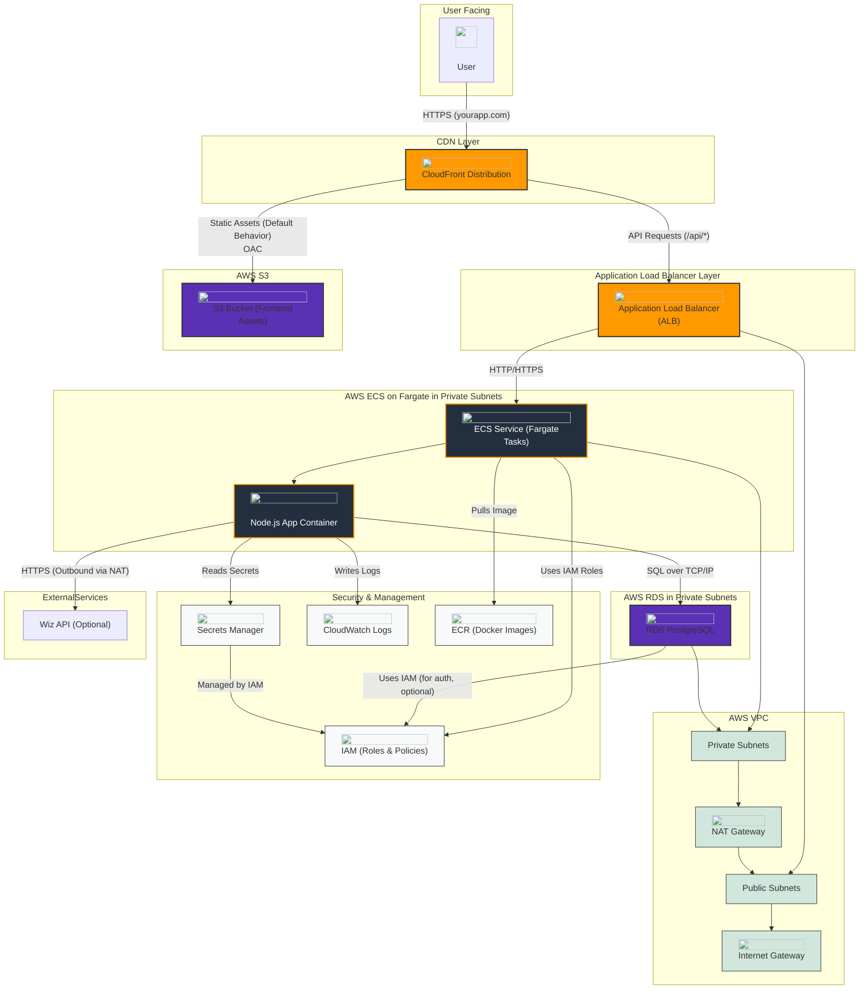

# AWS Architecture Diagram

This diagram illustrates the AWS architecture for the AI Security Posture Management (AI-SPM) platform, as defined by the CloudFormation template.

## Diagram

To view the diagram, use a Markdown preview tool with Mermaid support, or paste the code block below into the Mermaid Live Editor (https://mermaid.live).

