# AI-SPM Service Mesh Architecture

This diagram illustrates the modern hybrid microservices architecture with Istio service mesh for the AI Security Posture Management (AI-SPM) platform, featuring secure service-to-service communication and comprehensive observability.

## Architecture Overview

The platform uses a service mesh approach with:
- **Istio Service Mesh** for automatic mTLS, traffic management, and observability
- **Node.js API Gateway** for web services, authentication, and data management
- **Python Microservices** for specialized AI/ML tasks
- **React Frontend** with modern UI components
- **PostgreSQL Database** for persistent data storage
- **Zero Trust Security** with encrypted inter-service communication

## Architecture Diagram

To view the diagram, use a Markdown preview tool with Mermaid support, or paste the code block below into the Mermaid Live Editor (https://mermaid.live).

```mermaid
graph TB
    subgraph "External Users"
        Users["👥 Security Teams<br/>CISO, Analysts, Engineers<br/>Compliance Officers"]
    end

    subgraph "Istio Service Mesh Security Layer"
        IstioGateway["🚪 Istio Gateway<br/>TLS Termination<br/>External Traffic Entry<br/>Security Headers"]
        ServiceMesh["🔐 Service Mesh (Istio)<br/>Automatic mTLS<br/>Authorization Policies<br/>Traffic Management<br/>Observability"]
    end

    subgraph "Frontend Layer"
        Frontend["🌐 React Frontend<br/>Modern UI with shadcn/ui<br/>Authentication & Dashboard<br/>Real-time Updates"]
    end

    subgraph "API Gateway Layer"
        Gateway["⚡ Node.js API Gateway<br/>Express.js + Envoy Sidecar<br/>Session Management<br/>Service Orchestration<br/>Request Validation"]
    end

    subgraph "Python Microservices (Secured by mTLS)"
        AIScanner["🤖 AI Scanner Service<br/>Port: 8001 + Envoy Sidecar<br/>FastAPI + mTLS<br/>Model Security Analysis<br/>Bias Detection"]
        
        DataIntegrity["🔍 Data Integrity Service<br/>Port: 8002 + Envoy Sidecar<br/>FastAPI + mTLS<br/>Data Quality Checks<br/>Anomaly Detection"]
        
        WizIntegration["🔗 Wiz Integration Service<br/>Port: 8003 + Envoy Sidecar<br/>FastAPI + mTLS<br/>External API Data Transform<br/>Security Alert Processing"]
        
        ComplianceEngine["📋 Compliance Engine<br/>Port: 8004 + Envoy Sidecar<br/>FastAPI + mTLS<br/>Policy Evaluation<br/>Automated Assessments"]
    end

    subgraph "Data Layer"
        PostgreSQL["🗄️ PostgreSQL Database<br/>+ Envoy Sidecar<br/>Encrypted Connections<br/>Asset Inventory<br/>Vulnerability Data<br/>Compliance Records"]
    end

    subgraph "Observability Stack"
        Prometheus["📊 Prometheus<br/>Metrics Collection<br/>Performance Monitoring"]
        Jaeger["🔍 Jaeger<br/>Distributed Tracing<br/>Request Flow Analysis"]
        Grafana["📈 Grafana<br/>Dashboards<br/>Alerting"]
        Kiali["🕸️ Kiali<br/>Service Mesh Topology<br/>Traffic Visualization"]
    end

    subgraph "External Integrations"
        WizAPI["🛡️ Wiz Security Platform<br/>Cloud Security Posture<br/>Vulnerability Data"]
        MLModels["🧠 AI/ML Models<br/>Security Analysis<br/>Risk Assessment"]
    end

    %% User Flow Through Service Mesh
    Users --> IstioGateway
    IstioGateway --> Frontend
    Frontend --> ServiceMesh
    ServiceMesh --> Gateway
    
    %% Secure Microservices Communication (All through mTLS)
    Gateway -.->|mTLS Encrypted| AIScanner
    Gateway -.->|mTLS Encrypted| DataIntegrity
    Gateway -.->|mTLS Encrypted| WizIntegration
    Gateway -.->|mTLS Encrypted| ComplianceEngine
    
    %% Database Access (All through mTLS)
    Gateway -.->|mTLS Encrypted| PostgreSQL
    AIScanner -.->|mTLS Encrypted| PostgreSQL
    DataIntegrity -.->|mTLS Encrypted| PostgreSQL
    WizIntegration -.->|mTLS Encrypted| PostgreSQL
    ComplianceEngine -.->|mTLS Encrypted| PostgreSQL
    
    %% External Communications (Egress through Service Mesh)
    WizIntegration --> WizAPI
    AIScanner --> MLModels
    
    %% Observability Data Flow
    ServiceMesh --> Prometheus
    ServiceMesh --> Jaeger
    Prometheus --> Grafana
    Jaeger --> Kiali
    
    %% Service Mesh manages all internal communication
    ServiceMesh -.->|Manages| Gateway
    ServiceMesh -.->|Manages| AIScanner
    ServiceMesh -.->|Manages| DataIntegrity
    ServiceMesh -.->|Manages| WizIntegration
    ServiceMesh -.->|Manages| ComplianceEngine
    ServiceMesh -.->|Manages| PostgreSQL

    %% Styling
    classDef users fill:#ff9999,stroke:#333,stroke-width:2px,color:#000
    classDef servicemesh fill:#ff6b35,stroke:#333,stroke-width:3px,color:#fff
    classDef frontend fill:#61dafb,stroke:#333,stroke-width:2px,color:#000
    classDef gateway fill:#2ecc71,stroke:#333,stroke-width:2px,color:#fff
    classDef microservice fill:#9b59b6,stroke:#333,stroke-width:2px,color:#fff
    classDef database fill:#e74c3c,stroke:#333,stroke-width:2px,color:#fff
    classDef observability fill:#f39c12,stroke:#333,stroke-width:2px,color:#fff
    classDef external fill:#95a5a6,stroke:#333,stroke-width:2px,color:#fff

    class Users users
    class IstioGateway,ServiceMesh servicemesh
    class Frontend frontend
    class Gateway gateway
    class AIScanner,DataIntegrity,WizIntegration,ComplianceEngine microservice
    class PostgreSQL database
    class Prometheus,Jaeger,Grafana,Kiali observability
    class WizAPI,MLModels external
```

## Key Architecture Benefits

### 🔐 **Zero Trust Security**
- **Automatic mTLS**: All inter-service communication encrypted and authenticated
- **Service Identity**: Each service has cryptographic identity with automatic certificate rotation
- **Authorization Policies**: Fine-grained access control between services
- **Network Security**: No implicit trust, every request must be authorized

### 🎯 **Separation of Concerns**
- **Node.js**: Handles web services, authentication, and data management
- **Python**: Specializes in AI/ML tasks, data processing, and external integrations
- **Service Mesh**: Manages all cross-cutting concerns (security, observability, traffic)

### 🚀 **Scalability & Resilience**
- Independent scaling of microservices based on demand
- Circuit breaking and fault injection for reliability testing
- Intelligent load balancing and traffic routing
- Canary deployments and blue-green deployments support

### 🔧 **Maintainability**
- Clear service boundaries and responsibilities
- Independent deployment and updates with zero downtime
- Technology stack optimization per service
- Declarative configuration for all service mesh policies

### 📊 **Comprehensive Observability**
- **Distributed Tracing**: End-to-end request flow visualization
- **Metrics Collection**: Performance and business metrics for all services
- **Access Logging**: Detailed logs of all service communications
- **Service Topology**: Real-time visualization of service dependencies

### 🔄 **Enterprise Integration**
- RESTful APIs for easy integration
- Standardized data formats and protocols
- Service mesh provides consistent security and observability
- External service integration through controlled egress policies
