# AI-SPM Hybrid Microservices Architecture

This diagram illustrates the modern hybrid microservices architecture for the AI Security Posture Management (AI-SPM) platform, featuring Node.js for web services and Python for AI-specific tasks.

## Architecture Overview

The platform uses a hybrid approach with:
- **Node.js API Gateway** for web services, authentication, and data management
- **Python Microservices** for specialized AI/ML tasks
- **React Frontend** with modern UI components
- **PostgreSQL Database** for persistent data storage

## Architecture Diagram

To view the diagram, use a Markdown preview tool with Mermaid support, or paste the code block below into the Mermaid Live Editor (https://mermaid.live).

```mermaid
graph TB
    subgraph "Frontend Layer"
        Frontend["🌐 React Frontend<br/>Modern UI with shadcn/ui<br/>Authentication & Dashboard"]
    end

    subgraph "Authentication & Session"
        Auth["🔐 Authentication Service<br/>Session Management<br/>Role-based Access Control"]
    end

    subgraph "API Gateway Layer"
        Gateway["⚡ Node.js API Gateway<br/>Express.js Server<br/>Route Management<br/>Request Validation"]
    end

    subgraph "Core Services Layer"
        WebServices["🌍 Web Services<br/>Asset Management<br/>Vulnerability Tracking<br/>Compliance Reporting<br/>Dashboard APIs"]
    end

    subgraph "Python Microservices"
        AIScanner["🤖 AI Scanner Service<br/>Port: 8001<br/>FastAPI<br/>Model Security Analysis<br/>Bias Detection"]
        
        DataIntegrity["🔍 Data Integrity Service<br/>Port: 8002<br/>FastAPI<br/>Data Quality Checks<br/>Anomaly Detection"]
        
        WizIntegration["🔗 Wiz Integration Service<br/>Port: 8003<br/>FastAPI<br/>External API Data Transform<br/>Security Alert Processing"]
        
        ComplianceEngine["📋 Compliance Engine<br/>Port: 8004<br/>FastAPI<br/>Policy Evaluation<br/>Automated Assessments"]
    end

    subgraph "Data Layer"
        PostgreSQL["🗄️ PostgreSQL Database<br/>Drizzle ORM<br/>Asset Inventory<br/>Vulnerability Data<br/>Compliance Records"]
    end

    subgraph "External Integrations"
        WizAPI["🛡️ Wiz Security Platform<br/>Cloud Security Posture<br/>Vulnerability Data"]
        MLModels["🧠 AI/ML Models<br/>Security Analysis<br/>Risk Assessment"]
    end

    %% User Flow
    Frontend --> Auth
    Auth --> Gateway
    Gateway --> WebServices
    
    %% Microservices Communication
    Gateway --> AIScanner
    Gateway --> DataIntegrity
    Gateway --> WizIntegration
    Gateway --> ComplianceEngine
    
    %% Data Access
    WebServices --> PostgreSQL
    AIScanner --> PostgreSQL
    DataIntegrity --> PostgreSQL
    WizIntegration --> PostgreSQL
    ComplianceEngine --> PostgreSQL
    
    %% External Communications
    WizIntegration --> WizAPI
    AIScanner --> MLModels
    
    %% Service Discovery & Communication
    Gateway -.->|HTTP/REST| AIScanner
    Gateway -.->|HTTP/REST| DataIntegrity
    Gateway -.->|HTTP/REST| WizIntegration
    Gateway -.->|HTTP/REST| ComplianceEngine

    %% Styling
    classDef frontend fill:#61dafb,stroke:#333,stroke-width:2px,color:#000
    classDef auth fill:#f39c12,stroke:#333,stroke-width:2px,color:#fff
    classDef gateway fill:#2ecc71,stroke:#333,stroke-width:2px,color:#fff
    classDef webservice fill:#3498db,stroke:#333,stroke-width:2px,color:#fff
    classDef microservice fill:#9b59b6,stroke:#333,stroke-width:2px,color:#fff
    classDef database fill:#e74c3c,stroke:#333,stroke-width:2px,color:#fff
    classDef external fill:#95a5a6,stroke:#333,stroke-width:2px,color:#fff

    class Frontend frontend
    class Auth auth
    class Gateway gateway
    class WebServices webservice
    class AIScanner,DataIntegrity,WizIntegration,ComplianceEngine microservice
    class PostgreSQL database
    class WizAPI,MLModels external
```

## Key Architecture Benefits

### 🎯 **Separation of Concerns**
- **Node.js**: Handles web services, authentication, and data management
- **Python**: Specializes in AI/ML tasks, data processing, and external integrations

### 🚀 **Scalability**
- Independent scaling of microservices based on demand
- Language-specific optimization for different workloads

### 🔧 **Maintainability**
- Clear service boundaries and responsibilities
- Independent deployment and updates
- Technology stack optimization per service

### 🛡️ **Security**
- Centralized authentication and authorization
- Service-to-service communication through API gateway
- Role-based access control across all services

### 🔄 **Enterprise Integration**
- RESTful APIs for easy integration
- Standardized data formats and protocols
- Comprehensive logging and monitoring capabilities
