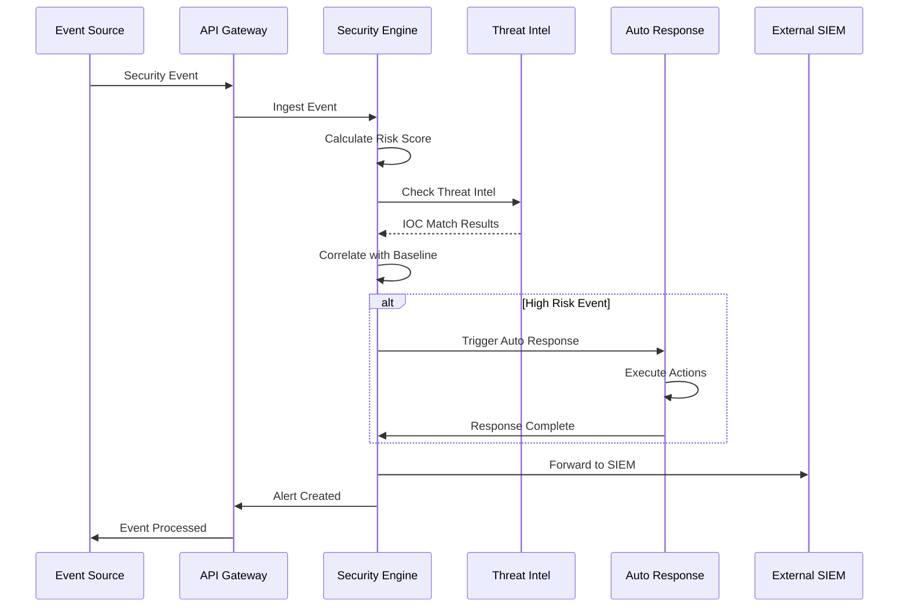

# AI Security Posture Management Platform - Enhanced Architecture Diagram

## System Architecture Overview

## Data Flow Diagrams

### Authentication Flow

### Security Event Processing Flow

### AI/ML Security Validation Flow

## Security Architecture

### Zero Trust Network Model

### Security Event Flow

## Deployment Architecture

### Kubernetes Deployment

This enhanced architecture provides enterprise-grade security, comprehensive AI/ML protection, automated privacy governance, and advanced threat detection capabilities while maintaining high performance and scalability.